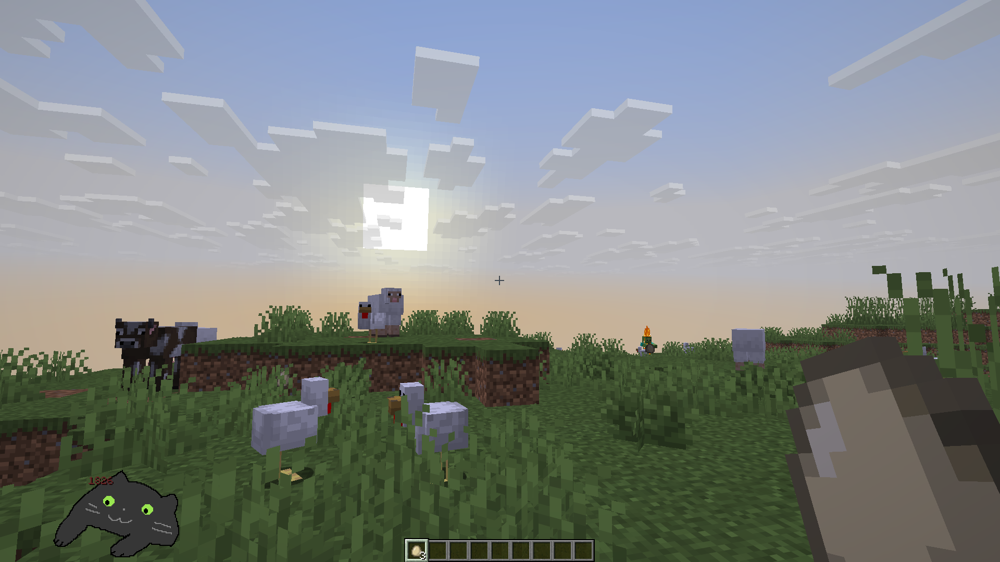
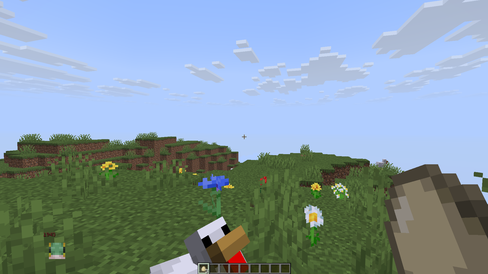
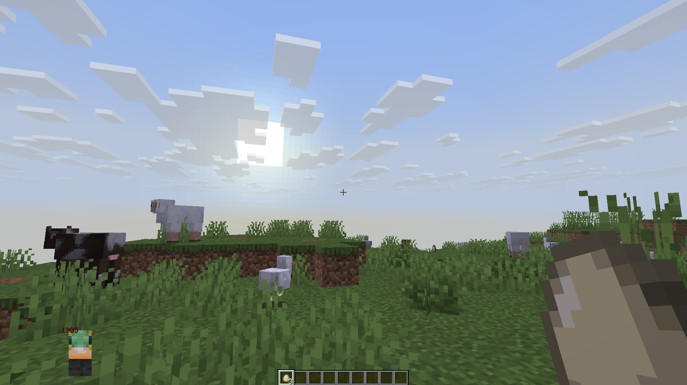
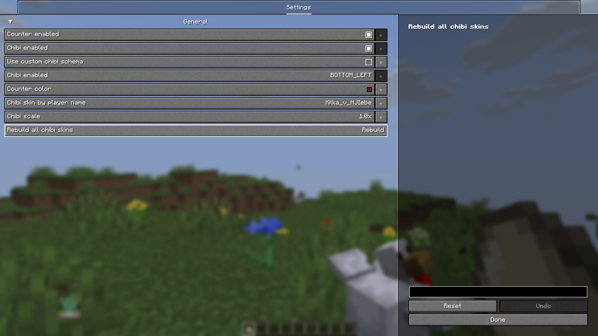

# BongoCube

## RU

## Описание

BongoCube — мод, добавляющий в игру отображение чиби-фигурки кота/игрока и счетчик кликов. Включает внутриигровую таблицу лидеров и гибкую систему настроек с возможностью создать кастомную схему чибиков (смотрите на вики).

## Требования

- Fabric API
- YACL (Yet Another Config Lib)
- ModMenu

## Установка

1. Установите Fabric Loader и Fabric API
2. Скачайте последнюю версию мода
3. Помстите мод в папку `mods`
4. Запустите игру

## Использование

- Открыть таблицу лидеров: `J` (по умолчанию)
- Настройки доступны через ModMenu

## Конфигурация

Все настройки доступны через внутриигровой интерфейс:
- Включение/отключение счетчика и чиби
- Позиция чиби на экране
- Масштаб чиби
- Цвет счетчика
- Кастомный чибик из скина или голова игрока по нику если схемы нет

---

## EN

## Description

BongoCube is a mod that adds a chibi figure of cat/player display and click counter to the game. Includes an in-game leaderboard and flexible configuration system with option to creat custom cibib scheme (check on wiki).

## Requirements

- Fabric API
- YACL (Yet Another Config Lib)
- ModMenu

## Installation

1. Install Fabric Loader and Fabric API
2. Download the latest mod version
3. Place the mod in the `mods` folder
4. Launch the game

## Usage

- Open leaderboard: `J` (default)
- Settings available via ModMenu

## Configuration

All settings are available through the in-game interface:
- Enable/disable counter and chibi
- Chibi position on screen
- Chibi scale
- Counter color
- Custom chibi of player skin or player head by nickname if you don't have custom scheme

# Галерея/Gallery

## Default chibi/Стандрантный чибик

## Defatult skin chibi/Стандартный чибик скина

## Custom chibi/Кастомный чибик

## Settings/Настройки

